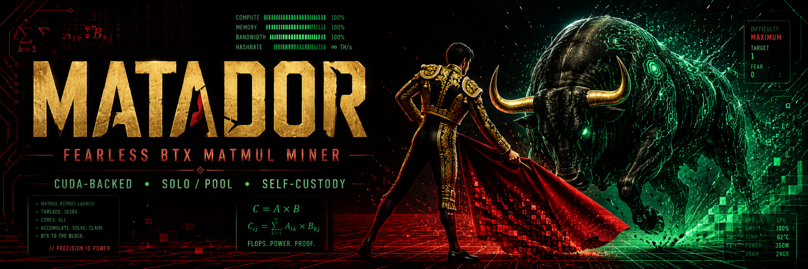

# matador-miner



**A fast, headless GPU miner for [`btxchain/btx`](https://github.com/btxchain/btx) (BTX) -
the MatMul proof-of-work. One static binary. Solo or pool. NVIDIA, Apple, AMD. Self-updating
and fleet-ready.**

Point it at your own node and keep 100% of every block, or pool-mine against
[minebtx](https://minebtx.com/) with one flag. It is fully decoupled from the node, so the
miner can update or restart without ever touching `btxd`.

```bash
# install + start mining a pool (repeat --pool for automatic failover to a backup):
curl -fsSL https://raw.githubusercontent.com/vanities/matador-miner/main/install.sh | bash
matador-miner --mode pool \
  --pool stratum+tcp://stratum.minebtx.com:3333 \
  --pool stratum+tcp://stratum.bitminerpool.xyz:3333 \
  --worker rig1 --payoutaddress btx1zcf4z36asua8ylchysphgwfgyfr8267vvznth826epden7lar4fnqvy9gzv
```

## Why matador

- **One binary, every platform.** A single static release runs on NVIDIA (CUDA), Apple
  Silicon (Metal), and AMD (HIP/ROCm via a bundled sidecar). The backend auto-detects.
- **Solo *or* pool.** Solo mines against your own `btxd` (`getblocktemplate` -> `submitblock`)
  and keeps every block self-custodied; pool mode talks stratum to minebtx/dexbtx pools for
  steady payouts. Same solver either way.
- **Self-updating, safely.** Checks GitHub on a schedule and atomically upgrades itself - same
  PID, no node restart - so a fleet stays current with zero ops. Every update is **sha256-verified
  before it's swapped in**: a corrupt or tampered download is refused and the miner just keeps
  running the version it's on. A **bake-time** delay means it won't jump onto a brand-new release
  until it has aged, so a bad release is caught (on a canary) before the fleet adopts it. Stable
  channel only, by default; opt out any time.
- **Fleet-ready.** Run one coordinator (your node + a least-privilege work proxy + a telemetry
  dashboard) and point any number of disposable rigs at it. They hop on and off, share one
  wallet, and never collide.
- **Observable.** A read-only JSON status API (on by default, loopback) for dashboards,
  watchdogs, and the fleet hub.

## Supported hardware

| Backend | Status |
|---|---|
| NVIDIA CUDA - fat binary (`sm_80` / `86` / `89` / `90` / `120`, Ampere -> Blackwell) | working |
| NVIDIA CUDA - `-legacy` build (`sm_60` / `61` / `70` / `75`, Pascal -> Turing) | working (`v0.7.1`+) - validated on Tesla V100, Titan V, Tesla T4, Titan Xp (0 rejects) |
| NVIDIA multi-GPU | working |
| Apple Silicon (Metal) | working |
| AMD (HIP/ROCm) | sidecar bridge to the companion solver in [`amdbtx`](https://github.com/thekillsquad007/amdbtx) |

> The **`-legacy` build** covers older NVIDIA cards (Pascal / Volta / Turing, e.g. GTX 10-series)
> and links CUDA 12.8 ([benchmarks](docs/gpu-benchmarks.md#legacy-gpus-pascal--volta--turing)). No
> config needed: `install.sh` auto-routes old GPUs to the `-legacy` asset, and the build enables the
> older-GPU path itself.

**Measured rates** - popular cards below; the **[full 39-GPU benchmark](docs/gpu-benchmarks.md)**
covers every model. matador `--mode pool` on rented Vast.ai instances at stock power, v0.6.8, June
2026; ~80-100% util, 0 rejects. Sorted by **efficiency** (`nonce/s per W`); `value` = thousands of nonce/s per Vast `$/hr`.

| GPU | nonce/s | Power | nonce/s per W | Vast $/hr | value |
|---|--:|--:|--:|--:|--:|
| RTX 4070 Ti | 9.3k | ~200W | ~46 | ~0.24 | **38.5** |
| RTX 5090 (`sm_120`) | 32.3k | ~577W | ~56 | ~0.39 | **83.2** |
| RTX 4090 (`sm_89`) | 21.6k | ~413W | ~52 | ~0.35 | **62.1** |
| RTX 5070 | 10.6k | ~238W | ~45 | ~0.17 | **60.9** |
| H100 SXM (`sm_90`) | 15.8k | ~383W | ~41 | ~1.92 | **8.2** |
| RTX 4080 | 14.6k | ~291W | ~50 | ~0.34 | **43.5** |
| A100 SXM4 (`sm_80`) | 10.9k | ~250W | ~44 | ~0.55 | **19.8** |
| RTX 3090 | 9.1k | ~296W | ~31 | ~0.13 | **70.2** |
| RTX 3070 | 6.2k | ~232W | ~27 | ~0.09 | **71.1** |
| RTX 3060 (`sm_86`) | 2.2k | ~64W | ~34 | ~0.06 | **39.9** |
| Apple M4 Max | Metal: ~1.1k-1.3k | - | - | - | - |

> **Measured on v0.6.8**, June 2026, and still current on **v0.7.1** - the v0.7.x releases left
> NVIDIA Ampere+ throughput unchanged (they fixed the legacy GPU build and macOS Metal). Up roughly
> **1.5x-2.0x** over the earlier pre-v0.5.0 rates (the RTX 5090 went from 18.8k to **32.3k nonce/s**).
> Each card is a single steady-state sample and Vast `$/hr` float with the marketplace, so read this
> as a snapshot, not a leaderboard.

Consumer cards win on value by 2-4x: this PoW is integer/ALU work, so the AI-datacenter premium
(A100, H100, RTX 6000) buys tensor cores it can't use. **See
[docs/gpu-benchmarks.md](docs/gpu-benchmarks.md)** for all 39 GPUs, efficiency + throughput
rankings, methodology, and AMD + legacy notes. To sort by any column yourself, open
**[docs/gpu-benchmarks.csv](docs/gpu-benchmarks.csv)** (GitHub renders it as a sortable,
searchable table). Reproduce with `scripts/vast-bench.sh`. Your numbers welcome - see
[Help wanted](#help-wanted).

## Quick start

**1. Install** (Linux one-liner: fetches the latest release, verifies the sha256, installs to
`/usr/local/bin` or `~/.local/bin`):

```bash
curl -fsSL https://raw.githubusercontent.com/vanities/matador-miner/main/install.sh | bash
```

This puts `matador-miner` on your `PATH`, so you run it as `matador-miner` from anywhere - no
`./`. (The `./bin/matador-miner` form further down is only for the un-extracted release bundle.)

**2. Mine.** The backend **auto-detects** (CUDA on NVIDIA, Metal on Apple Silicon), so no flag
is needed. **AMD is the one exception: add `--backend hip`.**

```bash
# Pool - no node required (2nd --pool is a backup; matador fails over if the 1st is down):
matador-miner --mode pool \
  --pool stratum+tcp://stratum.minebtx.com:3333 \
  --pool stratum+tcp://stratum.bitminerpool.xyz:3333 \
  --worker rig1 --payoutaddress btx1zcf4z36asua8ylchysphgwfgyfr8267vvznth826epden7lar4fnqvy9gzv

# Solo - against your own btxd (v0.32.12+, RPC on); keep 100% of every block, no fee:
matador-miner \
  --payoutaddress btx1zcf4z36asua8ylchysphgwfgyfr8267vvznth826epden7lar4fnqvy9gzv \
  --rpccookiefile ~/.btx/.cookie          # or --rpcuser/--rpcpassword
# solo is the default mode; add --rpcconnect/--rpcport if btxd isn't on 127.0.0.1:19334
```

You should see a `nonce/s` / `scan=...MN/s` heartbeat within seconds. That's it. The examples
use the project's payout address so they run as-is - **set `--payoutaddress` to your own
`btx1...` to mine to yourself.**

**Prefer a config file?** Copy the template for your GPU and just run it:

```bash
cp config.example.nvidia.json matador.json   # or config.example.amd.json / .mac.json
$EDITOR matador.json                          # set payout address + worker
matador-miner                                 # auto-loads ./matador.json
```

## Install in detail

**Release bundle (recommended).** Each release ships a per-platform `*-bundle.tar.gz` with the
binary, GPU config templates, and (on Linux) the AMD/HIP sidecar:

```bash
# matador-miner-<ver>-linux-x86_64-bundle.tar.gz   NVIDIA CUDA + AMD/HIP sidecar
# matador-miner-<ver>-macos-arm64-bundle.tar.gz    Apple Metal
curl -fsSLO "<bundle-url>" && curl -fsSLO "<bundle-url>.sha256"
sha256sum -c matador-miner-*-bundle.tar.gz.sha256     # must print OK   (shasum -a 256 on macOS)
tar xzf matador-miner-*-bundle.tar.gz && cd matador-miner-*/
cp config.example.nvidia.json matador.json && $EDITOR matador.json
./bin/matador-miner
```

**Bare binary.** The one-liner above, or pin/redirect it: `VERSION=v0.4.0 PREFIX=$HOME/.local/bin`
before the pipe. To verify by hand instead of trusting the script:

```bash
api=https://api.github.com/repos/vanities/matador-miner/releases
url=$(curl -fsSL "$api" | grep -oE '"browser_download_url": *"[^"]+linux-x86_64"' | cut -d'"' -f4)
curl -fsSLO "$url" && curl -fsSLO "$url.sha256"
sha256sum -c "$(basename "$url").sha256"              # must print OK
chmod +x "$(basename "$url")" && sudo mv "$(basename "$url")" /usr/local/bin/matador-miner
matador-miner --help
```

## HiveOS

Each release ships a HiveOS custom-miner package: `matador-miner-<ver>.tar.gz`. Create a
flight sheet with miner **Custom**, click **Setup Miner Config**, and fill:

| Field | Value |
|---|---|
| Miner name | `matador-miner` |
| Installation URL | `https://github.com/vanities/matador-miner/releases/download/v0.8.25/matador-miner-0.8.25.tar.gz` |
| Hash algorithm | `btx` |
| Wallet and worker template | `%WAL%.%WORKER_NAME%` |
| Pool URL | `stratum+tcp://stratum.minebtx.com:3333` |
| Pass | `x` |
| Extra config arguments | optional matador CLI flags, e.g. `--no-gpu-suffix` |

Set the flight sheet wallet to your BTX address (`btx1...`). An example flight sheet JSON
is in [docs/hiveos-flight-sheet.example.json](docs/hiveos-flight-sheet.example.json).

- Mines on **all GPUs**, one pool worker per card (`rig-gpu0`, `rig-gpu1`, ...). Add
  `--no-gpu-suffix` to report the whole rig as a single worker, or `--gpus 0,1` to pin cards.
- The package picks the right binary per rig automatically: main (Ampere and newer) or
  `-legacy` (Pascal / Volta / Turing).
- Hashrate (nonce/s, shown as kH/s), per-GPU temps, and accepted/rejected shares show up on
  the HiveOS dashboard; the JSON status API stays available on the rig at `127.0.0.1:4060`.
- Works with both stratum and login-style pools. Solo-through-pool: use
  `solo:%WAL%.%WORKER_NAME%` as the template where the pool supports it.
- Under HiveOS the self-updater is off (the flight sheet owns the install). To update, point
  the Installation URL at the newer release tar.gz and reapply the flight sheet.

## macOS menu-bar app

Prefer a GUI on Apple Silicon? **MatadorBar** is a one-click menu-bar front-end that supervises
the miner for you, no terminal required.

1. Download **[MatadorBar.dmg](https://github.com/vanities/matador-miner/releases/latest/download/MatadorBar.dmg)** from the latest release.
2. Open the DMG, drag **MatadorBar** to Applications, then launch it.
3. Click the menu-bar bolt, pick **Payout Address -> Add Address...**, paste your BTX address, and it starts mining.

It is signed and notarized by Apple (no "unidentified developer" warning), bundles the Metal
engine, and shows live status (state, rate, shares, GPU). From the menu you can switch pool or
payout address, pause/resume mining, open your address in the block explorer to check your
balance, and toggle open-at-login. The engine auto-updates itself, and the app keeps mining
whenever it is open. The status glyph is green while mining, yellow when paused.

## Auto-update

On by default: the miner checks GitHub releases at startup and every 30 min, and when a newer
one ships it downloads the platform binary, verifies its sha256, atomically swaps itself, and
re-exec's into it **with the same PID and no `btxd` restart**. Works the same under systemd,
`nohup`, `tmux`, `screen`, or a foreground shell.

> **Requirement:** the binary must live in a path **writable by the user running it**.
> `install.sh` uses `~/.local/bin` when you're not root, which works out of the box. If you
> `sudo`-install to `/usr/local/bin` but run as a normal user, the self-update can't replace
> the file (it logs `cannot replace binary ...` and keeps the old one) - run from a user-owned
> dir instead, e.g. `~/.local/bin` or an `/opt/matador/bin` you own.

Tune or disable: `--update-interval-s <sec>` (`0` = startup-only), `--update-channel prerelease`,
`--min-version-age-s <sec>` (bake time), or `--no-auto-update` (check + notify only). Details in
[`docs/matador-standalone-ops.md`](docs/matador-standalone-ops.md#auto-update).

## Configure

`matador-miner` picks safe defaults for the detected hardware, so there is little to turn:

| Knob (config / flag) | Default | Notes |
|---|---|---|
| `gpus` / `--gpus 0,1,2` | first GPU | multi-GPU fan-out; each card gets its own worker suffix + API port |
| `backend` / `--backend` | auto | `cuda` / `metal` / `hip` / `rocm` / `cpu` - only AMD needs it set |
| `pools` / `--pool` | - | one endpoint or an ordered failover list (pool mode) |

Full config keys and the systemd unit are in
[`docs/matador-standalone-ops.md`](docs/matador-standalone-ops.md). Example configs:
[nvidia](docs/config.example.nvidia.json) / [amd](docs/config.example.amd.json) /
[mac](docs/config.example.mac.json).

Pool: **[minebtx](https://minebtx.com/)** is the default (the examples use
`stratum+tcp://stratum.minebtx.com:3333`) -
[live dashboard](https://pool.minebtx.com/) -
[dexbtx/minebtx source](https://github.com/dexbtx/minebtx). Any dexbtx-style pool works too,
e.g. [bitminerpool.xyz](https://bitminerpool.xyz/#miners) - just point `--pool` at its stratum
endpoint.

## Run a fleet

Mine across many machines from one node and one dashboard. A **coordinator** runs your `btxd`
+ `matador-gbt-proxy` (a least-privilege work proxy: token auth, only `getblocktemplate` /
`submitblock`) + `matador-hub` (telemetry + dashboard). **Workers** are disposable - no node,
no chain state - so they hop on and off with zero warmup. They share one payout wallet, and a
per-rig coinbase extranonce keeps their work disjoint (no duplicate effort), exactly like a
pool partitions across miners.

```bash
# on the coordinator:
FLEET_TOKEN=... NODE_COOKIE=~/.btx/.cookie \
  HUB_WORKERS="rig1=http://10.0.0.11:4060,rig2=http://10.0.0.12:4060" \
  scripts/matador-coordinator.sh --listen 10.0.0.1
# dashboard -> http://10.0.0.1:4070
# workers   -> matador-miner --mode solo --rpcconnect 10.0.0.1 --rpcport 4071 \
#                --rpcuser rig1 --rpcpassword "$FLEET_TOKEN" --worker rig1 --payoutaddress btx1...
```

Workers can also **fall back to a pool** if the coordinator drops (`--fallback-pool ...`) and
**idle-gate** the GPU so a workstation only mines when it's free (`--should-mine-command ...`).
Full copy-paste setup (VPN + laptop dashboard, fallback, idle-gate) is in
**[`docs/matador-fleet.md`](docs/matador-fleet.md)**.

## Monitor

A read-only HTTP status API runs by default on `127.0.0.1:4060` (`--no-api` to disable,
`--api-listen` to bind a LAN/VPN address). It never exposes RPC credentials or pool passwords.

```bash
curl -s http://127.0.0.1:4060/health     # {"status":"ok"}
curl -s http://127.0.0.1:4060/summary    # version, mode, backend, shares, nonces, GPU temp/power, update state
curl -s http://127.0.0.1:4060/pools      # effective failover pool list
scripts/matador-status.sh                # readable terminal dashboard over the same API
```

`/summary` is the one to scrape for a dashboard - shares, live `nonce/s`, per-GPU
util/power/temp, watchdog state, and the auto-update block (running vs latest version). For
multi-GPU rigs each child increments the port: `4060`, `4061`, ...

## AMD / ROCm

Pass `--backend hip` (or `rocm`) and matador hands solves to the companion C++/HIP solver
`btx-gbt-solve-hip` from [`amdbtx`](https://github.com/thekillsquad007/amdbtx). Linux release
bundles include it and auto-discover `bin/btx-gbt-solve-hip`; otherwise build it with
`private/matador-miner/build-hip-sidecar.sh` (set `HIP_ARCHS="gfx1030 gfx1100"` to narrow it)
or point `--hip-solver` / config `sidecars.hip` at your own. The bundled sidecar links **ROCm 7**;
on ROCm 6.x, build it yourself from amdbtx. If the sidecar is missing or fails, matador logs why
and falls back to its in-process path.

## Reliability

Pool mode supports ordered `pools[]` failover, a reject-streak watchdog that triggers a safe
reconnect, optional pool-fallback for solo workers, and a warning-only thermal monitor (it never
changes clocks, fans, or power limits). A 1% time-based dev fee funds development - the coinbase
pays the dev address for ~36s of each hour, logged on entry and exit.

## Trust & self-custody

- **Self-custody.** Solo submits to *your* `btxd` over localhost RPC and holds **no wallet keys**;
  rewards pay the `--payoutaddress` you provide.
- **Closed-source binary.** **Verify the sha256** of every download before running it
  (the bundle and one-liner do this for you). Use `LOG_LEVEL=debug` for troubleshooting.
- **Loopback by default.** The status API binds `127.0.0.1`; only expose it on a LAN/VPN you
  control.

## Help wanted

The RTX 5090 is mined first-hand; the rest of the rates table - and the legacy GPUs - were validated
on rented Vast.ai instances, while the AMD sidecar is **built but not yet validated on real AMD
hardware**. So numbers from other gear, especially AMD, genuinely help:

- **NVIDIA (`sm_80`-`sm_120`):** `nonce/s` + `scan=...MN/s` from the `[stats]` line, plus card +
  driver.
- **AMD (`--backend hip`):** confirm `btx-gbt-solve-hip` solves and lands shares, with GPU + ROCm
  version.
- **Apple Silicon (`--backend metal`):** `nonce/s` per chip.

Easiest way to share: `scripts/matador-status.sh` (or `curl -s .../summary`) prints a clean
snapshot - open an issue with it + your OS/driver, or PR a row into the rates table.

## Credits

- **[`btxchain/btx`](https://github.com/btxchain/btx)** - the BTX node, the MatMul proof-of-work,
  and the CUDA backend this builds and mines with.
- **[`dexbtx/minebtx`](https://github.com/dexbtx/minebtx)** (shib) - the minebtx pool and stratum
  orchestrator; the protocol reference for the v2/v3 seed + `parent_mtp` handling.
- **[`thekillsquad007/amdbtx`](https://github.com/thekillsquad007/amdbtx)** - the companion
  C++/HIP solver (`btx-gbt-solve-hip`) matador bridges to for AMD/ROCm mining.

## License

Proprietary - Copyright (c) 2026 AM2 LLC. All rights reserved. See [LICENSE](LICENSE).
Third-party components (btxchain/btx and its Bitcoin Core lineage) remain under the MIT License.
matador-miner release binaries ship under their own end-user terms.
